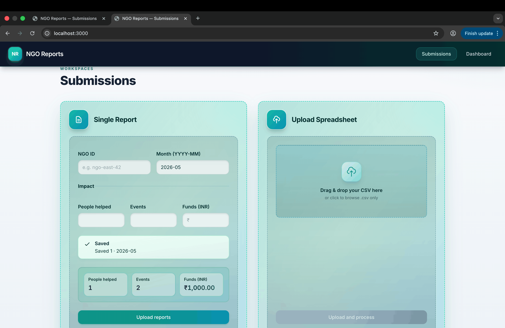
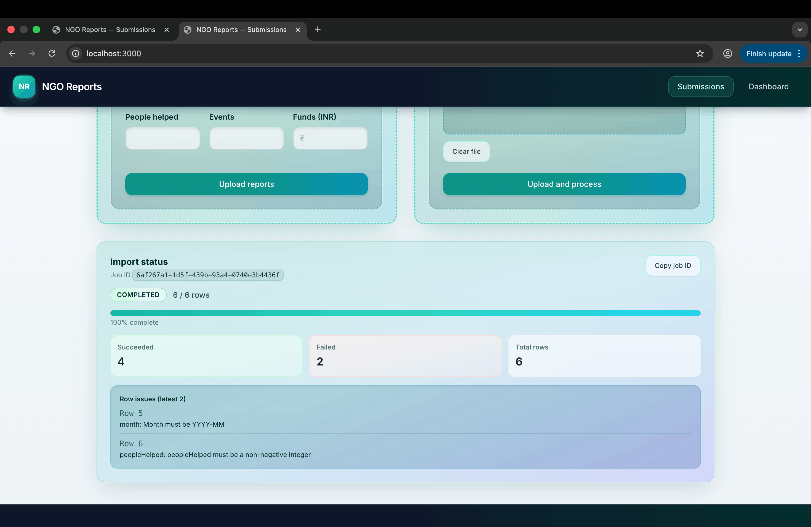
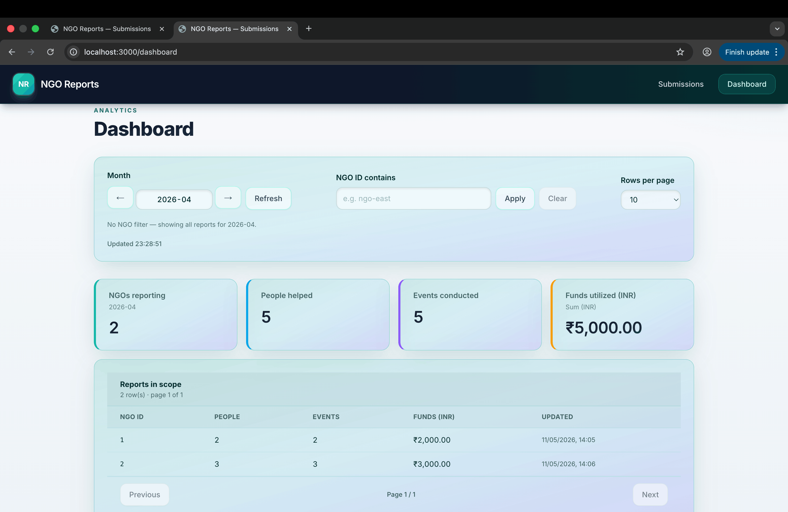

# NGO Monthly Report Management

NGOs submit **monthly impact** data (one form or **CSV bulk**); reviewers see **dashboard aggregates** and a **paginated** report table. Built for the **SDE II Take Home**: async CSV processing, job polling, partial failures, **idempotent** `(ngo_id, month)` upserts.

---

## Tech stack

| Layer | Choice |
| --- | --- |
| Frontend | Next.js 14 (App Router), React 18, Tailwind CSS |
| Backend | Node.js 18+, Express |
| Database | PostgreSQL, Prisma ORM |
| Jobs | **BullMQ + Redis** (CSV work off the HTTP request; worker consumes the queue) |
| Language | JavaScript (no TypeScript) |

---

## Setup

**Prerequisites:** Node 18+, PostgreSQL 14+, Redis 6+ (or Docker).

### Option A — Docker (full stack)

From repo root:

```bash
docker compose up --build
```

- App: **http://localhost:3000** · API: **http://localhost:4000**
- Postgres on host defaults to **localhost:5433** → container `5432` · Redis on host **localhost:6380** → `6379` (see `docker-compose.yml` to override).

### Option B — Local dev

1. **Env:** copy repo-root `.env.example` → `backend/.env` and set `DATABASE_URL`, `REDIS_URL` (template matches Docker host ports **5433** / **6380** if you only run DB/Redis via Compose).

2. **Backend + migrations + worker** (two terminals):

```bash
cd backend && npm install
npx prisma migrate dev   # or: npm run prisma:migrate:dev
npm run dev              # API :4000
```

```bash
cd backend && npm run worker:dev
```

3. **Frontend:**

```bash
cd frontend && npm install
echo 'NEXT_PUBLIC_API_URL=http://localhost:4000' > .env.local
npm run dev              # http://localhost:3000
```

**Smoke:** `curl -s http://localhost:4000/health`

---

## API sample usage

Base URL: `http://localhost:4000` (use your deploy URL when hosted).

**Single report** (duplicate NGO + month updates the row):

```bash
curl -s -X POST http://localhost:4000/report \
  -H 'Content-Type: application/json' \
  -d '{"ngoId":"NGO-100","month":"2024-06","peopleHelped":120,"eventsConducted":4,"fundsUtilized":99500.25}'
```

**CSV upload** → `202` + `jobId`; poll **`GET /job-status/:job_id`** for `status`, `processedRows`, `errors[]`, etc.:

```bash
curl -s -X POST http://localhost:4000/reports/upload -F 'file=@./your.csv'
curl -s "http://localhost:4000/dashboard?month=2024-06&page=1&pageSize=10"
```

Snake_case JSON/CSV headers also supported. Full request/response detail → [Appendix: API reference](#appendix-api-reference).

---

## UI (screenshots)

Screenshots live in **`docs/screenshots/`** (versioned in the repo).

### Submissions — single report (`/`)



### Submissions — bulk CSV (`/`)



### Dashboard (`/dashboard`)



---

## Live demo

| | |
| --- | --- |
| **Demo recording** | [Demo-Report-Management.mov (Google Drive)](https://drive.google.com/file/d/1IH2gAJCo7Lxv3FuiruZQVrDqtdqvGKGM/view?usp=sharing) — walkthrough of submissions, bulk CSV, and dashboard. |

_Local dev:_ **http://localhost:3000** after setup.

---

## Write-up (deliverable)

### Approach & architectural decisions

- **Thin HTTP layer:** Express controllers call services; Prisma stays in repositories. Validation is shared between REST and the CSV worker.
- **Async CSV:** Upload only writes the file, creates `import_jobs`, and **enqueues BullMQ**. A **separate worker** parses rows, validates, **upserts** `reports`, and updates job progress/errors so the client can poll without blocking the API.
- **Idempotency:** Unique `(ngo_id, month)` + Prisma `upsert` so re-submits and CSV duplicates **update** one row per NGO-month; dashboard aggregates stay consistent.
- **Frontend:** Next.js App Router; submissions on **`/`** (grid + `display: contents` for aligned panels); dashboard filters persisted in **`sessionStorage`** for a smoother reviewer flow.

### Where AI tools were used (if applicable)

Cursor / AI assistants helped with **scaffolding**, **BullMQ + Prisma wiring patterns**, **UI layout tweaks**, **README structure**, and incremental refactors. Requirements and behavior follow the **take-home PDF**; business logic, validation rules, and data model were reviewed by hand.

### What we’d improve for production or with more time

- **AuthN/AuthZ** (org-scoped NGOs), structured **logging + metrics**, **rate limits** on upload.
- **Object storage** for CSVs, **TTL/retention** on jobs and temp files, **idempotent upload** keys if needed.
- **OpenAPI** spec, **integration tests** (API + worker), **retries** for transient DB errors on bulk rows.
- **Observability:** dashboards, alerts, dead-letter handling for failed jobs.

---

## Appendix: reference

### Architecture (brief)

1. `POST /reports/upload` → save file → `ImportJob` → enqueue → **202** + `jobId`.
2. Worker: parse CSV → per-row validate → upsert or append error → progress updates for polling.
3. `GET /dashboard` → aggregates + paginated rows; optional `ngoId` substring filter on totals and list.

### Database

- **`reports`:** one row per NGO per `YYYY-MM` month; `funds_utilized` as `Decimal(18,2)` INR.
- **`import_jobs`:** `status`, row counters, JSON `errors` (row + message), `file_path` until cleanup.

### Folder structure

```
backend/src/  config, controllers, middleware, queues, repositories, routes, services, validations, workers, utils
frontend/     app/, components/, hooks/, services/api/, utils/
```

### Appendix: API reference

**`POST /report`** — JSON body; snake_case aliases allowed.

**`POST /reports/upload`** — multipart field **`file`** (CSV).

**`GET /job-status/:job_id`** — `jobId`, `status`, `totalRows`, `processedRows`, `successCount`, `failureCount`, `errors[]`, timestamps.

**`GET /dashboard?month=YYYY-MM`** — optional `ngoId`, `page`, `pageSize` (max 50). Response: `month`, `filters`, totals, `reports[]`, `pagination`.

### CSV headers

`ngo_id`, `month`, `people_helped`, `events_conducted`, `funds_utilized` (INR). Headers: case-insensitive; spaces → underscores.

### Deployment notes

- Migrations: `cd backend && npm run prisma:migrate` (or `npx prisma migrate deploy`).
- Processes: API `node src/server.js`, worker `node src/workers/csvImportWorker.js`.
- Env: `DATABASE_URL`, `REDIS_URL`, `CORS_ORIGIN`, `UPLOADS_DIR`, `NEXT_PUBLIC_API_URL` on the frontend build.

### Scripts

| Location | Command |
| --- | --- |
| `backend` | `npm run dev` · `npm run start` · `npm run worker` · `npm run worker:dev` · `npm run prisma:migrate:dev` · `npm run prisma:migrate` · `npm run prisma:generate` |
| `frontend` | `npm run dev` · `npm run build` · `npm start` |
| repo root | `docker compose up --build` |
